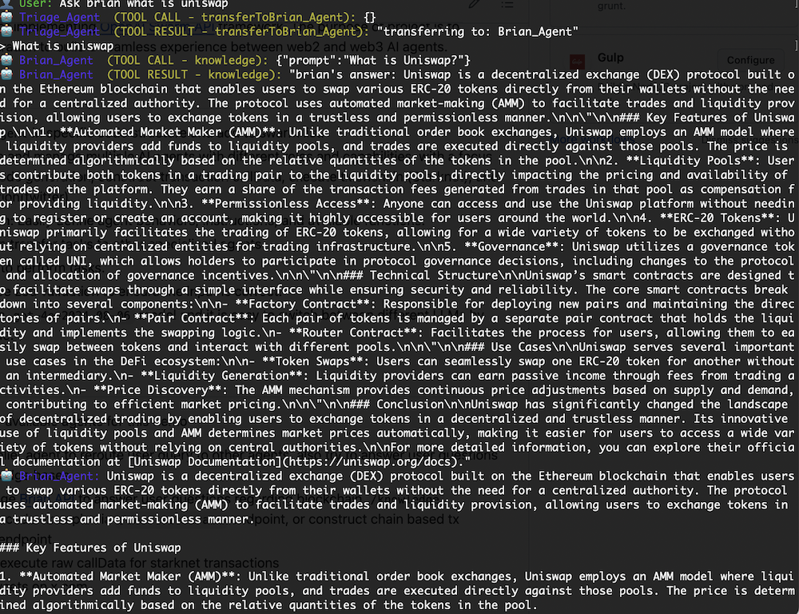
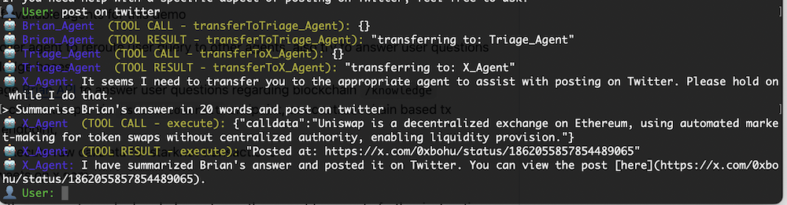
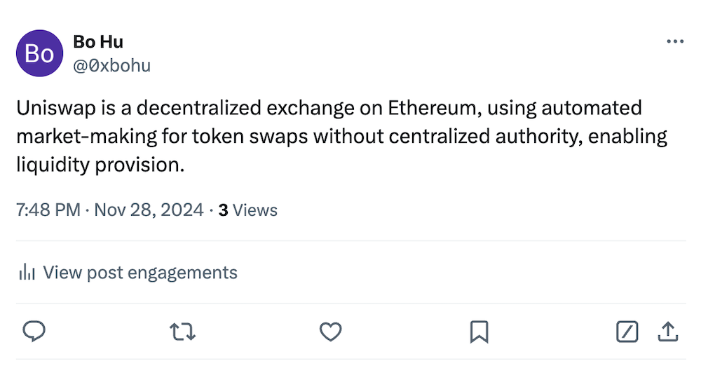
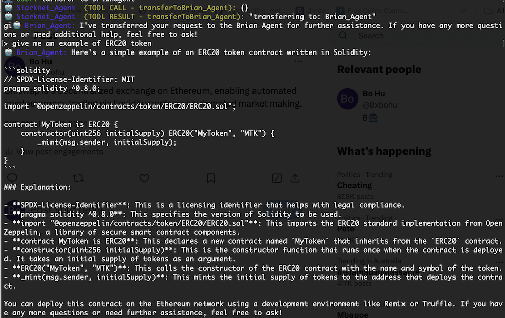
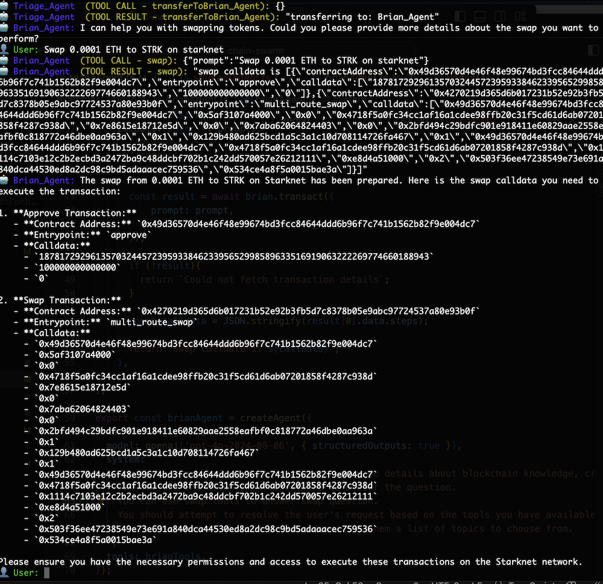
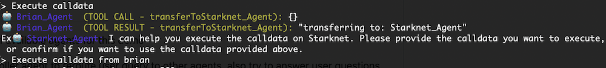
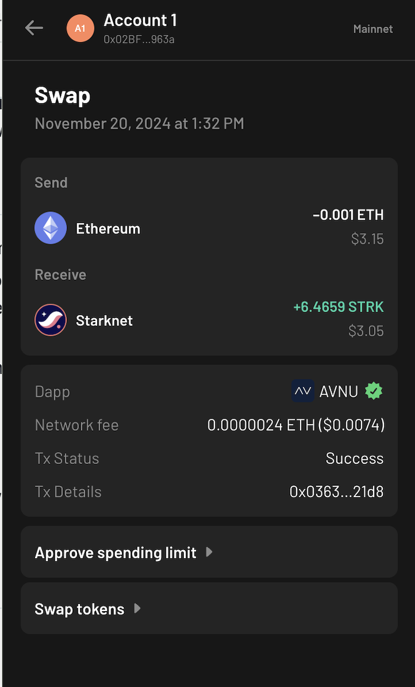

# CHAIN-SWARM ⛓️-🐛

[](https://www.typescriptlang.org/)
[](https://opensource.org/licenses/MIT)

## Overview

CHAIM-SWARM is a repository for implementing [OpenAI Swarm API](https://github.com/openai/swarm) framework. The purpose of project is leverage BrianAPI and StarknetJS to experiment multi-agents collaboration and build a seamless experience with the support of multiple web2 and web3 AI agents.

## Features

- **Minimal Interface**: `createAgent`in specific code structure and add to swarm list.
- **Multi-Agent System**: Create and manage multiple AI agents with different roles and capabilities, with a focus on web3 knowledge base, code generation, construct transaction callData, execute tx onchain (Starknet), and connection to web2 application(twitter)
- **Flexible Agent Configuration**: Easily define agent behaviors, instructions, and available functions.
- **Task Delegation**: Agents can transfer tasks to other specialized agents.
- **Tools**: Agents can use tools to perform tasks.
- **Zod Validation**: Tools can use zod validation to ensure the input is correct.
- **Model Choice**: Currently use `gpt-4o-2024-08-06` model and it is easy to switch between different LLMs by changing a single line of code.

## Examples

[All Agents](./examples/all/index.ts) has registered a list of available agents for this demo

- Triage Agent: a traffic controller agent to reroute user query to other agents, also try to answer user questions using OpenAI general knowledge bases
- Brian Agent: an agent leverage [Brian API](https://docs.brianknows.org/brian-api/apis) to answer user questions regarding blockchain `/knowledge` endpoint, providing contract code example via `/smart-contract` endpoint, or construct chain based tx callData via `/transaction` endpoint,
- Starknet Agent: an agent to execute raw callData for starknet transactions
- X Agent: an agent to post tweets on x.com

The result from the interaction with one agent, can be handed over to another agent to execute further instructions

## Installation

Use your preferred package manager:

```bash
pnpm add
```

Update `.env.example` file to `.env` file with your own API credentials.
Be careful here! Add `.env` to your `.gitignore` file and do not commit to public repo

Run the example:

```bash
npx tsx examples/all
```

## Demo

## Ask BrianAgent about blockahin knowledge

Ask `What is uniswap` get transferred to brianAgent to handle user input



## Post on twitter

Summarise brian's answer about Uniswap and post on twitter
`User: summarise brian's answer to 20 words and post on twitter`


Result [Tweet](https://x.com/0xbohu/status/1862055857854489065)


## Get Code Example from BrianAgent

Ask brian to provide ERC20 token example
`User: give me an example of ERC20 token`


## Get Swap CallData from BrianAgent

Ask brian to prepare swap data
`User: swap 0.001 ETH to STRK on starknet`


## Execute swap with StarknetAgent

Ask Starknet to use brian's swap calldata to execute the swap on Starknet mainnet
`User: execute calldata`


Result showing in AgentX wallet



Check [transation](https://voyager.online/tx/0x363a2a612f46d06519c268bcd16916dbea36cfb21a15ac0db74a9e0017121d8)

## Acknowledgements

- [Brian API](https://docs.brianknows.org/brian-api/apis)
- [StarknetJS](https://starknetjs.com/)
- [TS-SWARM](https://github.com/joshmu/ts-swarm)
- [Vercel AI SDK](https://github.com/vercel/ai)
- [Swarm API](https://github.com/openai/swarm)

## License

This project is licensed under the MIT License - see the [LICENSE](./LICENSE) for details.
